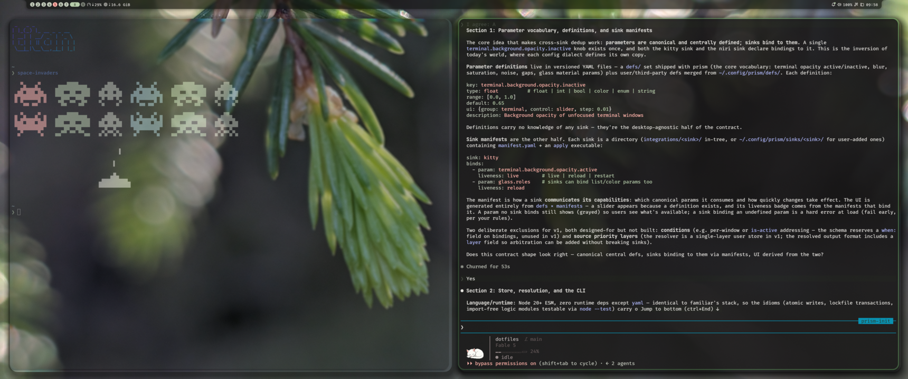

# Claude Code

Tested with Claude Code 2.1.238.

Select `Noctalia` from Claude Code's `/theme` picker after enabling the
template. Claude Code reloads changes to the generated theme automatically. If
its themes directory did not exist when Claude Code started, restart it once
after the first render.
