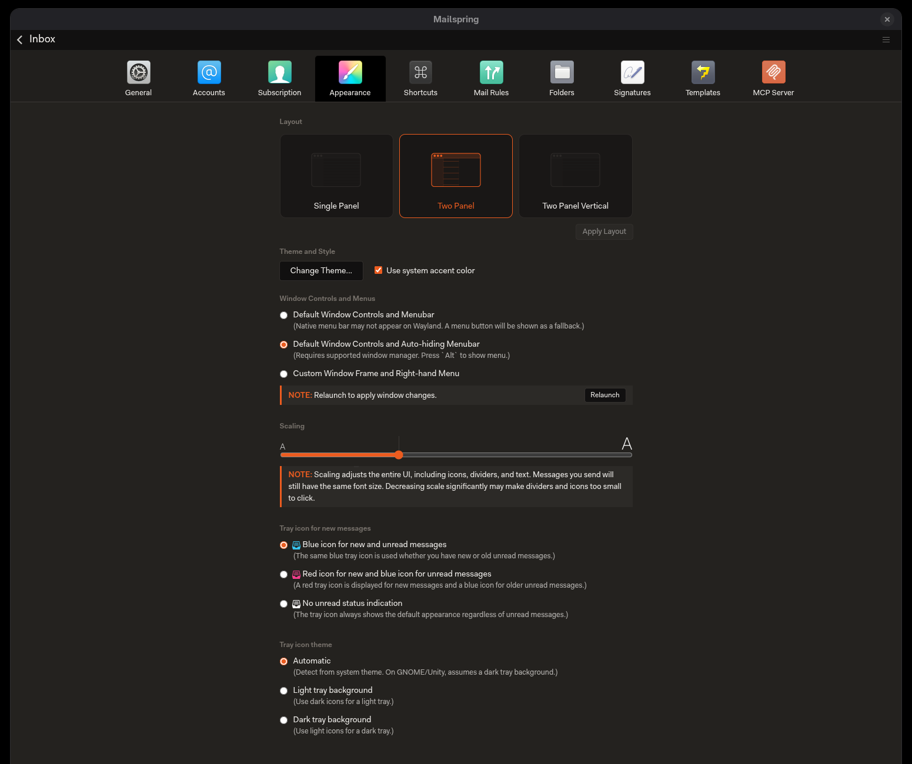
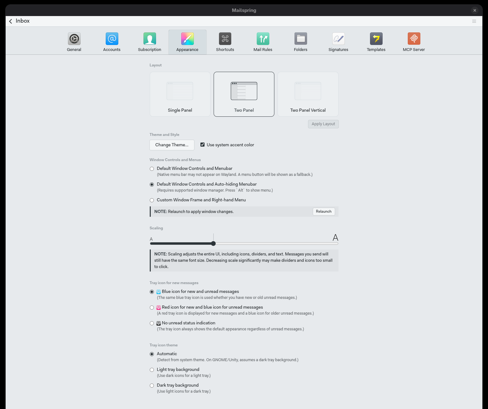

# Mailspring

Themes [Mailspring](https://getmailspring.com) with the Noctalia palette.

Mailspring themes are **packages**: a directory under the Mailspring config dir holding a
`package.json` and `styles/ui-variables.less`. Its own stylesheets (`/static`,
`/internal_packages`) are LESS that reads the variables declared in `base/ui-variables.less`,
so a theme recolors the whole app just by reassigning those variables. This template renders
both files straight into `packages/noctalia/`, for a native and a Flatpak install.

## What it themes

| Mailspring variable | Noctalia token |
| --- | --- |
| `@background-primary`, `@list-bg` | `surface` |
| `@background-secondary`, `@toolbar-background-color`, `@panel-background-color` | `surface_container` |
| `@background-tertiary`, `@list-hover-bg` | `surface_container_high` |
| `@text-color`, `@text-color-heading` | `on_surface` |
| `@text-color-subtle` / `-very-subtle` | `on_surface_variant` |
| `@accent-primary`, `@list-focused-bg`, `@text-color-link` | `primary` |
| `@text-color-inverse`, `@list-focused-color` | `on_primary` |
| `@border-color-*`, `@list-border`, `@input-border-color` | `outline_variant` / `outline` |
| `@input-bg` | `surface_container_lowest` |
| `@btn-action-bg-color` | `tertiary` |
| `@btn-danger-bg-color`, `@color-error` | `error` |
| `@color-success` / `@color-warning` | `terminal_normal_green` / `terminal_normal_yellow` |

The template uses `default`-mode tokens, so it follows whichever mode Noctalia is in.

On a dark palette it also applies the handful of fixes Mailspring's own `ui-dark` theme
carries, because variables cannot reach them: the thread-list icons are dark-on-light PNGs,
mail labels have baked-in colors, and the message shadow is drawn for a white page. Those
rules are guarded on the palette's lightness, so a light palette gets variables only.

## Setup

1. **Enable the template** in Noctalia (Settings → Templates → Mailspring). It writes
   `packages/noctalia/` into your Mailspring config directory
   (`~/.config/Mailspring`, or `~/.var/app/com.getmailspring.Mailspring/config/Mailspring`
   for the Flatpak).
2. **Restart Mailspring** so it picks up the new package.
3. **Select the theme once**: Preferences → Appearance → **Noctalia**.

## Apply changes

Mailspring compiles its LESS at startup and caches it, and it does not watch the theme
package on disk. **Restart Mailspring after a palette or mode change** to see the new colors.

## Notes

- "Use system accent color" in Preferences → Appearance can be left on or off. Mailspring's
  base theme derives the accent from `var(--system-accent, …)`, but this theme assigns a
  literal palette color, so the setting has nothing to override.
- Radio buttons, checkboxes and sliders are Chromium's native controls; the theme sets
  `accent-color` so they follow the palette too.
- The template does not touch `config.json`. Mailspring rewrites that file from memory while
  it runs, so an outside edit is silently lost — which is why the theme is selected by hand
  once, in the app.

## Removing the theme

Pick another theme in Preferences → Appearance, disable the template in Noctalia, and delete
`packages/noctalia/` from your Mailspring config directory.

## Files

| File | Purpose |
| --- | --- |
| `template.toml` | Noctalia manifest: four renders (two files × native/Flatpak) |
| `package.json` | Mailspring theme package manifest (static) |
| `ui-variables.less` | The themed variables plus dark-palette fixups |
| `screenshot.png` | Preferences → Appearance, dark palette |
| `light-screenshot.png` | Preferences → Appearance, light palette |

Tested against Mailspring 1.23.0 (Flatpak `com.getmailspring.Mailspring`).
