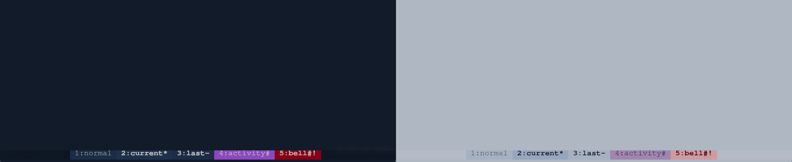

## Options

Inactive tabs use their own background by default. To make them inherit the status bar background, add this before the Noctalia `source-file` line in your tmux config:

```tmux
set -g @noctalia_inactive_tabs_use_background off
```
